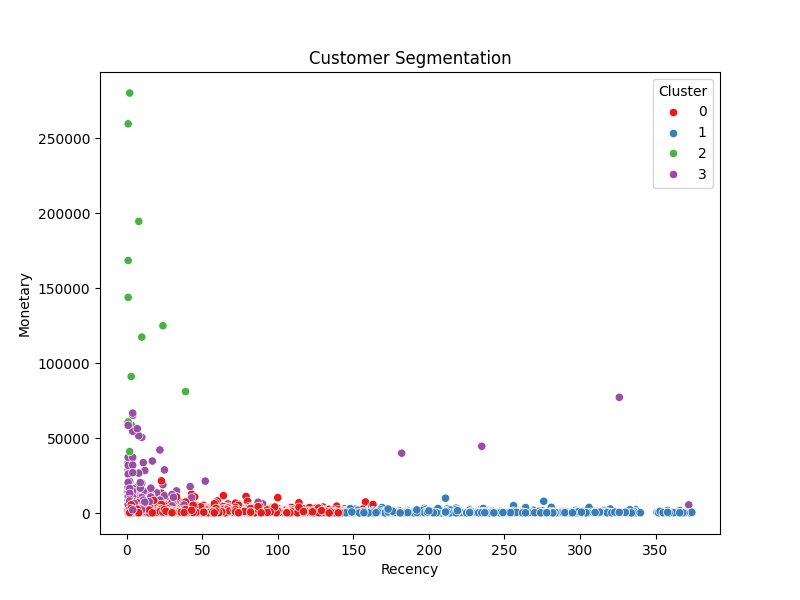

# Customer Segmentation Machine Learning System

## Overview

This project builds a **customer segmentation machine learning system** using transactional retail data.

Customer segmentation helps businesses understand different groups of customers based on purchasing behavior.
By identifying these groups, companies can design targeted marketing campaigns, improve customer retention, and increase revenue.

This project applies **RFM (Recency, Frequency, Monetary) analysis** and **K-Means clustering** to identify customer segments from an online retail dataset.

---

## Dataset

The dataset used in this project is the **Online Retail Dataset** from the UCI Machine Learning Repository.

It contains transactional data from an online retail store, including information about:

* Invoice number
* Product description
* Quantity purchased
* Transaction date
* Unit price
* Customer ID
* Country

Dataset size:

* **541,909 transactions**
* **4,338 unique customers after cleaning**

---

## Project Workflow

The project follows a complete **end-to-end data science workflow**:

1. Data loading
2. Data cleaning
3. Feature engineering (RFM analysis)
4. Feature scaling
5. Optimal cluster selection using the Elbow Method
6. Customer segmentation using K-Means clustering
7. Cluster visualization
8. Model saving for reuse

---

## Data Cleaning

Several preprocessing steps were applied to prepare the dataset:

* Removed rows with missing **CustomerID**
* Removed **cancelled orders**
* Removed transactions with **negative quantity**
* Removed transactions with **negative unit price**

After cleaning, the dataset contained valid customer transactions suitable for segmentation analysis.

---

## Feature Engineering (RFM Analysis)

Customer behavior was summarized using **RFM features**:

**Recency**

Number of days since the customer's last purchase.

**Frequency**

Total number of purchases made by the customer.

**Monetary**

Total amount spent by the customer.

These three features provide a powerful representation of customer value and purchasing behavior.

---

## Feature Scaling

Before clustering, features were standardized using **StandardScaler** to ensure that all variables contribute equally to the clustering process.

---

## Clustering Method

Customer segmentation was performed using the **K-Means clustering algorithm**.

K-Means groups customers into clusters based on similarity in their RFM behavior.

The algorithm assigns each customer to the cluster with the nearest centroid.

---

## Elbow Method

The optimal number of clusters was determined using the **Elbow Method**.

The inertia score was calculated for cluster values from **1 to 10**, and the elbow point in the curve indicated that **4 clusters** provided a good balance between simplicity and model performance.

---

## Customer Segmentation Results

The clustering algorithm grouped customers into **four segments** with distinct behavioral patterns.

Typical interpretations include:

**Cluster 0 — Loyal Customers**

* Frequent purchases
* Moderate to high spending

**Cluster 1 — High-Value Customers**

* High spending behavior
* Important target for retention

**Cluster 2 — New or Recent Customers**

* Recently active
* Opportunity for engagement

**Cluster 3 — Low-Value Customers**

* Infrequent purchases
* Lower spending

These insights can help businesses design personalized marketing strategies.

---

## Visualization

Customer segments were visualized using scatter plots to illustrate differences in purchasing behavior.

Recency vs Monetary segmentation:



---

## Model Saving

The trained clustering model was saved using **joblib** for reuse.

Saved model:

```
models/kmeans_customer_segmentation.pkl
```

This allows the segmentation model to be reused for future customer data.

---

## Project Structure

```
customer-segmentation-ml-khatantamir

data/
  raw/
    online_retail.xlsx

notebooks/
  customer_segmentation_analysis.ipynb

src/

models/
  kmeans_customer_segmentation.pkl

visualizations/
  customer_segmentation.png

requirements.txt
README.md
```

---

## Technologies Used

* Python
* Pandas
* NumPy
* Scikit-learn
* Matplotlib
* Seaborn
* Joblib

---

## Skills Demonstrated

This project demonstrates key **data science and machine learning skills**:

* Data cleaning and preprocessing
* Feature engineering
* Customer analytics
* Unsupervised machine learning
* Clustering algorithms
* Data visualization
* Machine learning model persistence

---

## Author

**Khatantamir Otgonbyamba**

GitHub Portfolio:
https://github.com/Khatantamir
